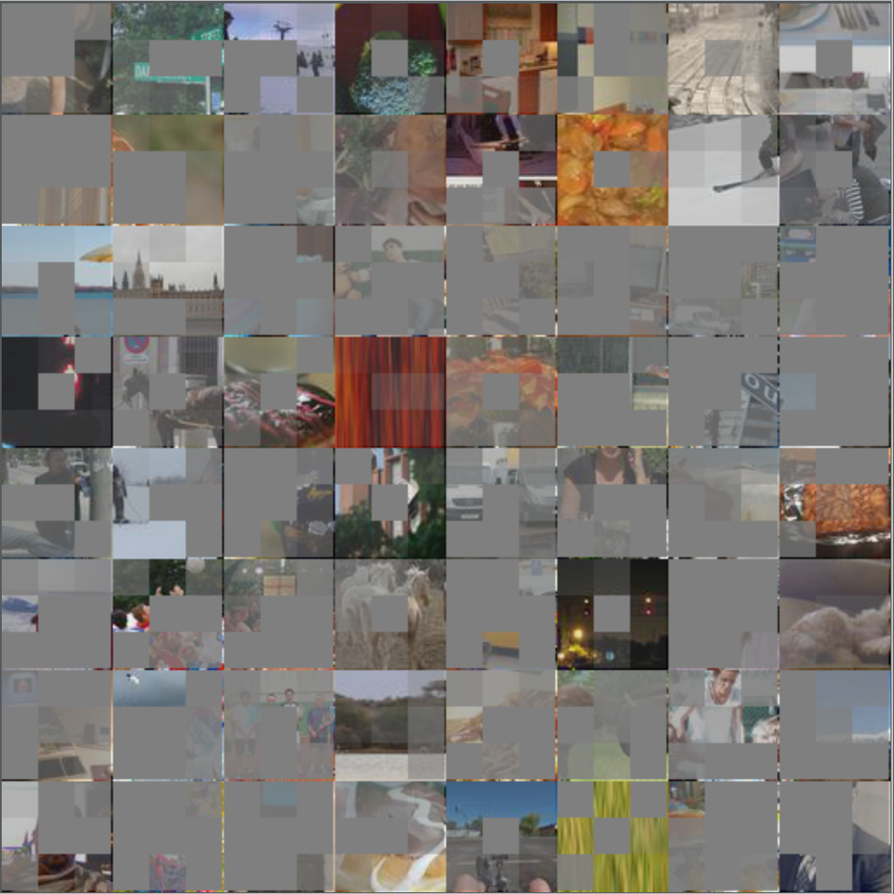

# DCGAN based Attentive Image Inpainter in Tensorflow

### Tried to apply attention mechansim on image inpainting, named grid attention
### Current State: too slow, not working well 
### TO-DO: try with not grid level, instead instance(object) level

more gray - pay little attention on that image grid

+ DCGAN completion code based on Raymond Yeh and Chen Chen et al.'s paper
  [Semantic Image Inpainting with Perceptual and Contextual Losses](https://arxiv.org/abs/1607.07539), add grid attention
+ Most of the code in this repository was written by modifying a
  duplicate of [Taehoon Kim's DCGAN-tensorflow](https://github.com/carpedm20/DCGAN-tensorflow) project, and [Bamos's dcgan-completion.tensorflow](https://github.com/bamos/dcgan-completion.tensorflow)
+ Bamos's image completion details can be found [here](http://bamos.github.io/2016/08/09/deep-completion/)

## how to use
1. prepare data, data shape should be 64x64
2. train dcgan: 
> $python train-dcgan.py --dataset data/your-dataset 
3. image inpainting with grid attention:
> $ python complete.py --dataset data/your-test-dataset --checkpointDir checkpint/you-checkpoint --use_attention True
